# README

## I look narcissistic. I steal your shits. 事實我不知道。I guess I am not MyAlias?

## Unity Projects

### Tutoirals

- [catlikecoding - Unity](https://catlikecoding.com/unity/tutorials/)

- [red-blob-games](https://www.redblobgames.com/)

- [Brackeys](https://www.youtube.com/@Brackeys)

Personal Unity Projects

WebGL builds deploy to [itch.io](https://ewdlop.itch.io/)

---

### With Legav(MyAlias)

#### ThisIsNotMario(>=50%)

#### SpaceProject(>=50%)

### https://legav.itch.io/occupational-hazard

### With Legav and Injured(MyAlias)

### Backpack-Simulator

Injured contributed the dad jokes and I followed up with more.

Injured is the one that - 啞巴吃黃蓮，有苦難說。

#### Chicken Dinner

[Chicken-Dinner](https://github.com/danhuynh0803/Chicken-Dinner)

[Chicken-Dinner-GGJ](https://dev.azure.com/ray810815/_git/GGJ)

#### Manual Breathing

#### Dyson Sphere

#### Help-desk

### Me(MyAlias>=50%)

#### SpaceProjectXL(MyAlias>=50%)

[SpaceProjectXL](https://github.com/ewdlop/SpaceProjectXL/tree/master?tab=readme-ov-file)

---

### Backpack-Simulator-EX(MyAlias>=50%)

C# implemntation of [Procedural Generated Hex Grid](https://www.redblobgames.com/grids/hexagons/) + [Perlin Noise](https://catlikecoding.com/unity/tutorials/pseudorandom-noise/perlin-noise/#:~:text=The%20idea%20of%20Perlin%20noise,the%20positive%20or%20negative%20version) 

Private Repo: [Backpack-Simulator-EX]([https://dev.azure.com/ray810815/Backpack-Simulator-EX](https://dev.azure.com/ray810815/LD42-Backpack-Simulator))

### HexGrid
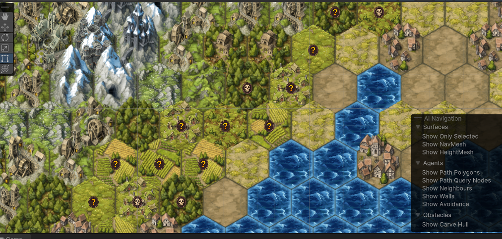
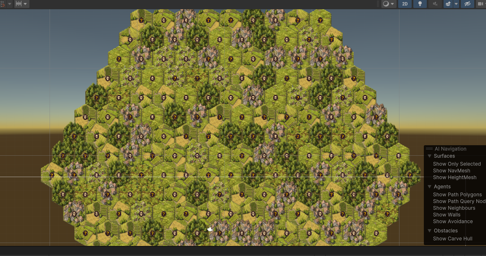

### Color Distance

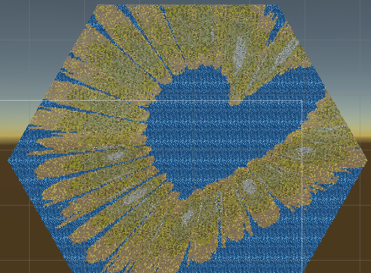
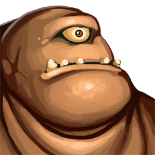
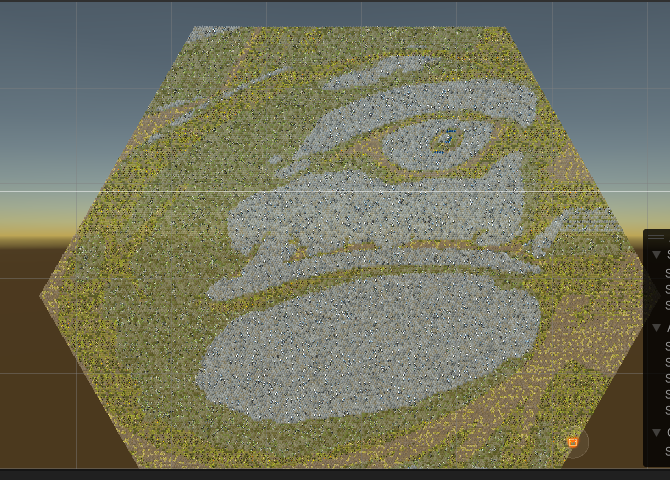

### Dad jokes(PreLLM(s) + ChatGPT)

---

### 3D Maze

Few Unity + C# port of Maze Generation Algorithm

[Mazes for Programmers - in Ruby](https://pragprog.com/titles/jbmaze/mazes-for-programmers/)

### Aldous-Broder:

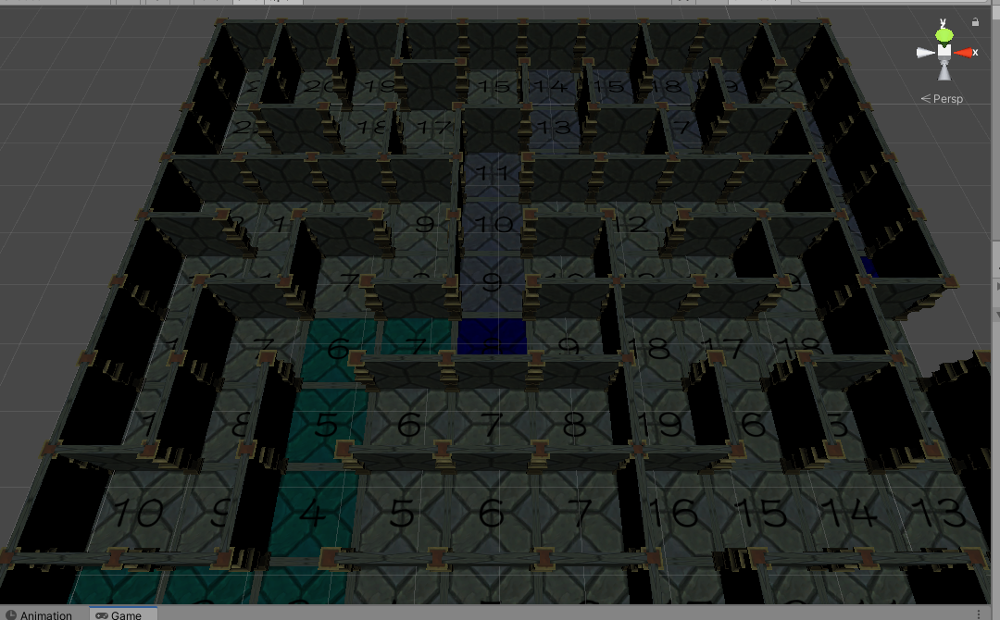

### BinaryTree

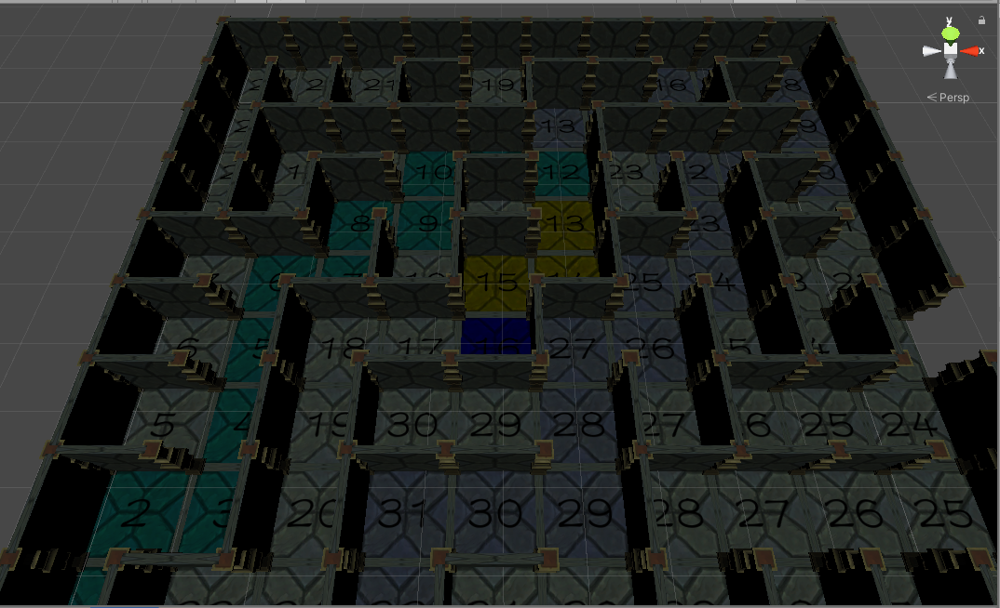

### Hunt And Kill

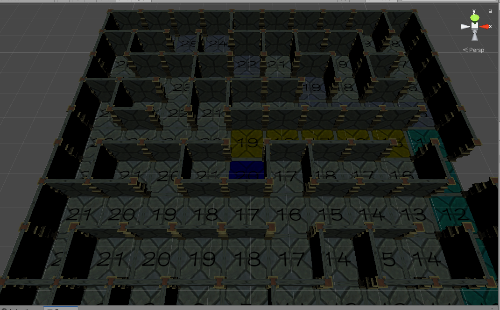

### Recursive BackTracker

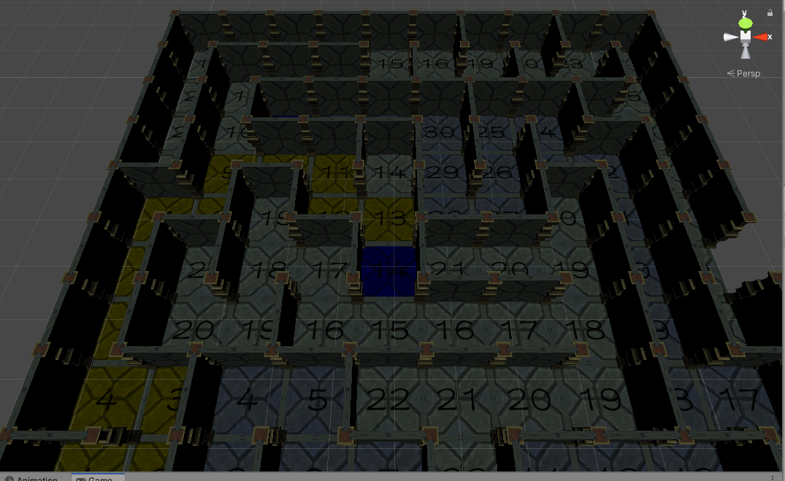

### Sidewinder

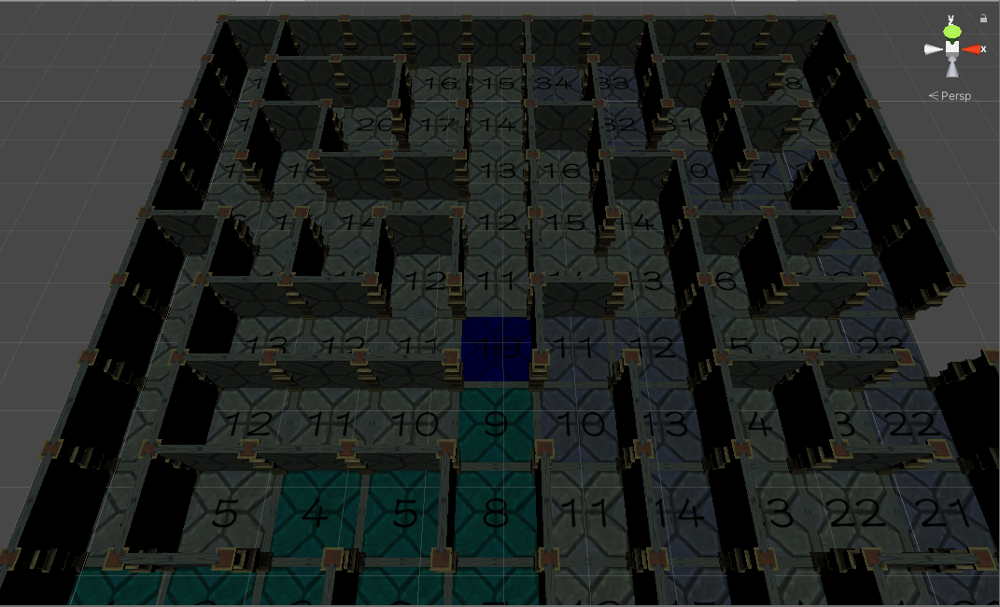

### Wilson

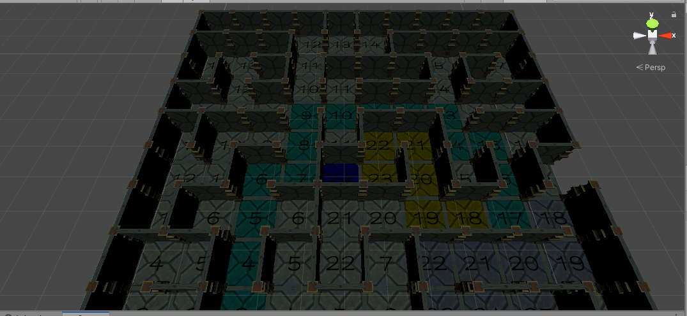

## This is Not Mario 2

~Fixing Links~

[ThisisNotMario2](https://github.com/ewdlop/ThisisNotMario2)

### Gameplay
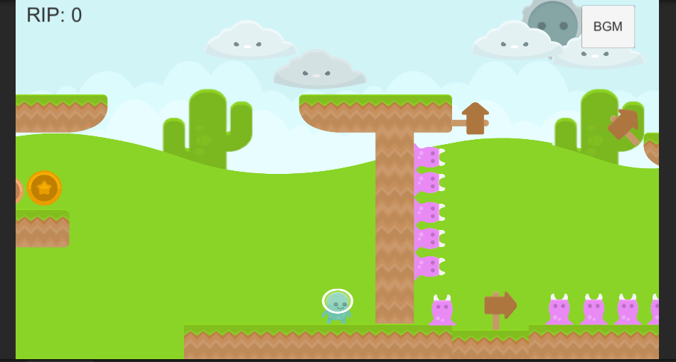
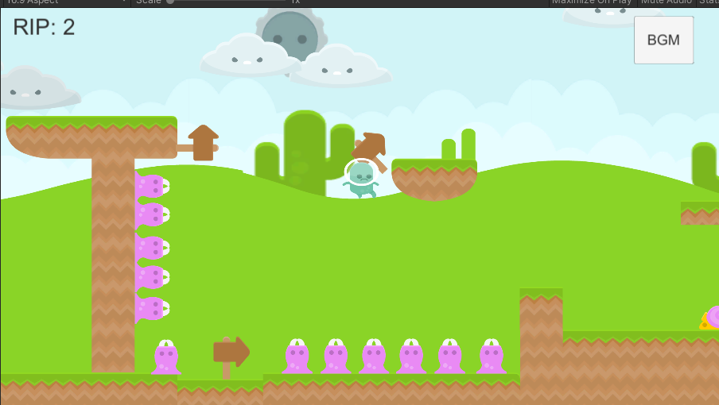
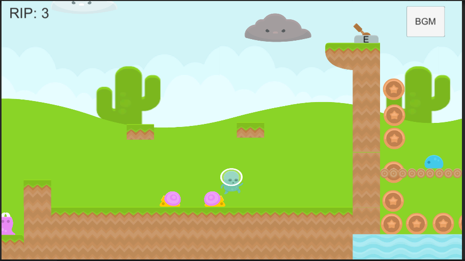

## Credit where credit is due. Thank you for providing the feedbacks! 我在救你們！
